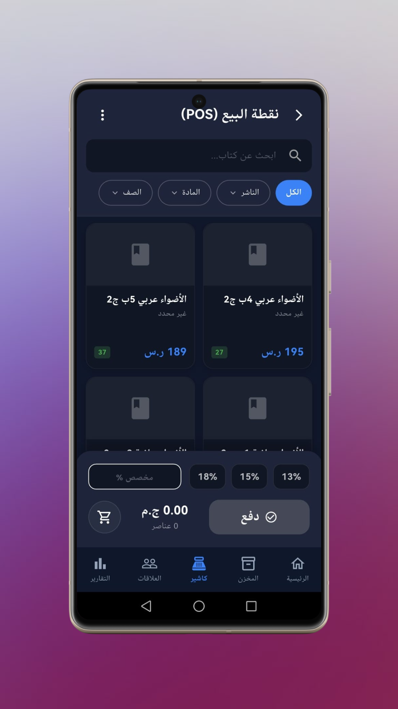
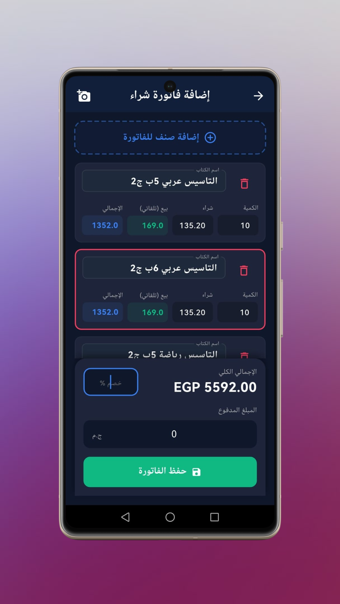

<div align="center">

# 📚 Smart Library Manager
### Offline-First & AI-Powered ERP Solution for Bookstores

<!-- Badges -->
[](https://flutter.dev/)
[](https://dart.dev/)
[](https://blog.cleancoder.com/uncle-bob/2012/08/13/the-clean-architecture.html)
[]()

<!-- Tech Stack Badges -->
[]()
[-003B57?style=flat-square)]()
[]()
[](https://azure.microsoft.com/en-us/services/cognitive-services/computer-vision/)
<br />

<!-- DOWNLOAD BUTTON -->
<a href="https://drive.google.com/drive/folders/1XCZH4j01MpMJBykdbk25tXJMt0xC_viE?usp=drive_link" target="_blank">
  
</a>

<br />
<br />

The **Smart Library Manager** is an advanced, offline-first Flutter application designed to revolutionize library and bookstore management. It bridges the gap between traditional ERP systems and modern AI-driven business intelligence.

</div>

---

## 📸 App Screenshots

| Dashboard & Analytics | Point of Sale (POS) | Invoice OCR Scanning | Inventory Management |
|:---:|:---:|:---:|:---:|
|  |  |  |  |

---

## 🚀 Key Features

### 🧠 AI-Powered Business Intelligence
*   **Stock Health Index:** Real-time scoring of inventory health.
*   **Smart Risk Analysis:**
    *   🚨 **Time Traps:** Identifies items unlikely to sell before deadlines.
    *   💀 **Dead Stock (Coma):** Flags items with zero sales velocity (30+ days).
    *   📉 **Early Failures:** Detects new products performing below thresholds.
*   **Restock Suggestions:** AI-driven purchasing recommendations based on sales velocity and seasonal trends.

### 📚 Advanced Inventory & OCR
*   **Seamless Digitization:** Integrated **Tesseract OCR** (Arabic support) to scan paper invoices and auto-fill data.
*   **Supplier Relations:** Track performance, return policies, and credit balances.
*   **Batch Operations:** Bulk import/export capabilities.

### 💰 Professional Point of Sale (POS)
*   **Streamlined Checkout:** Fast processing for sales, returns, and exchanges.
*   **Dynamic Pricing:** Manage discounts and customer debts on the fly.
*   **Customer Profiles:** Comprehensive history tracking and credit management.

### 🔄 Robust Architecture
*   **Offline-First Core:** Built on **Drift (SQLite)** ensuring 100% functionality without internet.
*   **Auto-Sync Engine:** Background service that synchronizes local changes with **Supabase** when connectivity is restored.

---

## 🛠️ Technology Stack

| Category | Technology |
|:--- |:--- |
| **Framework** | Flutter (Dart 3.x) |
| **State Management** | `flutter_bloc` (Cubits) |
| **Architecture** | Clean Architecture (Feature-First) |
| **DI** | `get_it`, `injectable` |
| **Local Database** | `drift` (SQLite) |
| **Remote Backend** | `supabase_flutter` |
| **AI & OCR** | `flutter_tesseract_ocr`, `google_mlkit` |
| **UI/UX** | `flutter_screenutil`, `fl_chart`, `google_fonts`, `flutter_animate` |

---

## 📂 Project Structure

The project follows a scalable **Feature-First Clean Architecture**:

```text
lib/
├── app/                  # App configuration & Routing
├── core/                 # Shared Kernel (Theme, Errors, Utils)
│   ├── database/         # Drift Schema & DAOs
│   └── services/         # Sync, OCR, & Background Workers
├── features/             # Modular Features
│   ├── dashboard/        # BI & Analytics
│   ├── inventory/        # Stock Logic
│   ├── invoices/         # OCR Scanning
│   ├── sales/            # POS System
│   └── ...
└── main.dart             # Entry Point


```
<div align="center">
Developed with ❤️ by <a href="https://github.com/amrloulah-dev">Amr Loulah</a>
</div>
